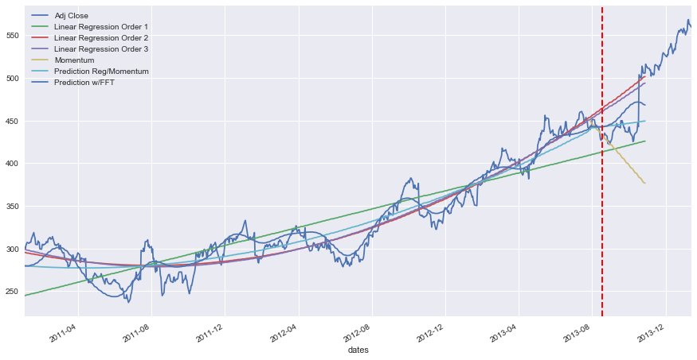
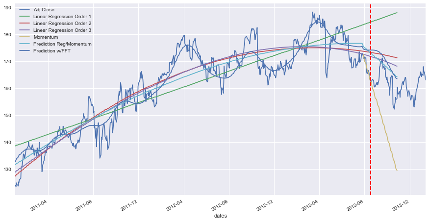
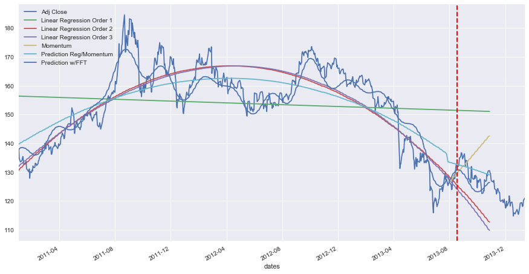
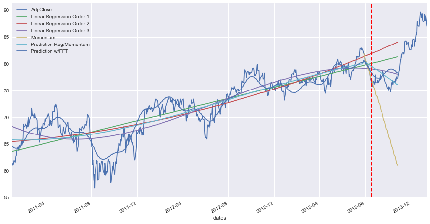
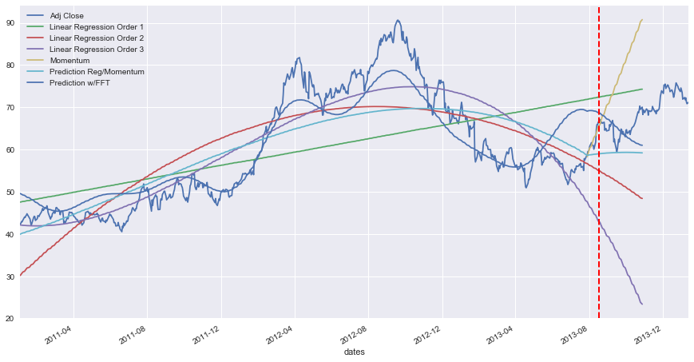

# Machine Learning Nanodegree

## Capstone Project

### Project: Stock Price Prediction


--- 


## User Interface for random stock and date range prediction

First, importing all required modules and libraries


```python
%matplotlib inline

import numpy as np
np.random.seed(0)

import time
import datetime
from calendar import monthrange
import pandas as pd

from IPython.display import display 
from IPython.display import clear_output

import warnings
warnings.filterwarnings('ignore')

from StockRegressor import StockRegressor
from StockRegressor import StockGridSearch

import matplotlib.pyplot as plt
plt.rcParams["figure.figsize"] = (15,8)

from IPython.display import Markdown, display

# initializing numpy seed so that we get reproduciable results, especially with Keras
np.random.seed(0)
```

    /anaconda/envs/stocktrading/lib/python3.5/site-packages/fix_yahoo_finance/__init__.py:43: DeprecationWarning: 
        Auto-overriding of pandas_datareader's get_data_yahoo() is deprecated and will be removed in future versions.
        Use pdr_override() to explicitly override it.
      DeprecationWarning)
    /anaconda/envs/stocktrading/lib/python3.5/site-packages/keras/backend/__init__.py:27: ResourceWarning: unclosed file <_io.TextIOWrapper name='/Users/Samer/.keras/keras.json' mode='r' encoding='UTF-8'>
      _config = json.load(open(_config_path))
    Using TensorFlow backend.
    /anaconda/envs/stocktrading/lib/python3.5/site-packages/tensorflow/python/util/deprecation.py:212: DeprecationWarning: inspect.getargspec() is deprecated, use inspect.signature() instead
      arg_spec = inspect.getargspec(func)
    /anaconda/envs/stocktrading/lib/python3.5/site-packages/tensorflow/contrib/keras/python/keras/backend.py:3593: ResourceWarning: unclosed file <_io.TextIOWrapper name='/Users/Samer/.keras/keras.json' mode='r' encoding='UTF-8'>
      _config = json.load(open(_config_path))
    /anaconda/envs/stocktrading/lib/python3.5/site-packages/tensorflow/contrib/labeled_tensor/python/ops/_typecheck.py:233: DeprecationWarning: inspect.getargspec() is deprecated, use inspect.signature() instead
      spec = inspect.getargspec(f)


---

The below is just to enable the Jupyter Notebook to show long output, without having to scroll.


```python


### Entering the Tickers and the Date Range

Please enter below the list of ticker symbols for the stocks you wish to predict, separated by commas e.g. GOOG, AAPL, IBM, GLD, XOM


```python
stock_names_str = input()
```

    GOOG, AAPL, IBM, GLD, XOM


Please enter below the data range for the stocks you wish to predict, separated by a comma, in YYYY-MM-DD format
e.g. 2011-01-01, 2013-08-18


```python
date_range_str = input()
```

    2011-01-01, 2013-08-18


### Instantiating the StockRegressor Objects

The below will instantiate the StockRegressor objects.


> **Note:**  Please note that there might be a bug in the Pandas library, that is causing an intermitten error with the Yahoo Finance web call. The bug could be traced to the file in /anaconda/envs/**your_environment**/lib/python3.5/site-packages/pandas/core/indexes/datetimes.py, at line 1050:
This line is causing the error: "if this.freq is None:". Another if condition should be inserted before that, to test for the "freq" attribute, such as: "if hasattr(this, 'freq'):"

> **Note:**  The fixed datetimes.py file is included with the submission


```python
date_range = date_range_str.replace(" ", "").strip('\n').split(',')
stock_tickers = stock_names_str.replace(" ", "").strip('\n').split(',')

stocks = {}

for ticker in stock_tickers:
    stocks[ticker] = StockRegressor(ticker, dates=date_range, n_days_to_read_ahead = 150)
    
```

    Getting pricing information for GOOG for the period 2011-01-01 to 2014-01-15
    Pricing file for stock doesnt exist. Downloading prices.
    [*********************100%***********************]  1 of 1 downloaded
    Yahoo Finance web service didnt return any data.
    Please wait. Retrying ....
    Took 0.87 seconds to load.
    Getting pricing information for AAPL for the period 2011-01-01 to 2014-01-15
    Pricing file for stock doesnt exist. Downloading prices.
    [*********************100%***********************]  1 of 1 downloaded
    Yahoo Finance web service didnt return any data.
    Please wait. Retrying ....
    Took 0.90 seconds to load.
    Getting pricing information for IBM for the period 2011-01-01 to 2014-01-15
    Pricing file for stock doesnt exist. Downloading prices.
    [*********************100%***********************]  1 of 1 downloaded
    Yahoo Finance web service didnt return any data.
    Please wait. Retrying ....
    Took 0.92 seconds to load.
    Getting pricing information for GLD for the period 2011-01-01 to 2014-01-15
    Pricing file for stock doesnt exist. Downloading prices.
    [*********************100%***********************]  1 of 1 downloaded
    Yahoo Finance web service didnt return any data.
    Please wait. Retrying ....
    Took 0.85 seconds to load.
    Getting pricing information for XOM for the period 2011-01-01 to 2014-01-15
    Pricing file for stock doesnt exist. Downloading prices.
    [*********************100%***********************]  1 of 1 downloaded
    Yahoo Finance web service didnt return any data.
    Please wait. Retrying ....
    Took 1.00 seconds to load.


### Training, Scoring, Predicting and Plotting

Default values of the hyper-parameters are: 

* Regressions: regressions of polynomial order 1, 2, and 3 are implemented
* Number of harmonics: default is set to 4
* Underlying Trend Poly of order 3 is used for the FFT de-trending
* Days for Regression: the default is set to 15
* Momentum Split: the default is set to 0.25


```python
for ticker, stock in stocks.items():
    print("\n--------------------------------------------------------------------")
    print("--------------------------------------------------------------------")
    print("--------------------------------------------------------------------")
    print("--------------------------------------------------------------------\n")
    current_ticker = "**Now training {} ... \n**".format(ticker)
    display(Markdown(current_ticker))
    stock.train()
    stock.score_verbose()
    stock.predict()
    stock.plot_learning_data_frame()
```

    
    --------------------------------------------------------------------
    --------------------------------------------------------------------
    --------------------------------------------------------------------
    --------------------------------------------------------------------
    


**Now training GOOG ... 
**


    Training end date is 2013-08-18, corresponding to the 660th sample
    The data has 660 training samples and 103 testing samples with a total of 763 samples
    Training set has 660 samples.
    Testing set has 50 samples.
    Regression Model Coefficients of Poly degree 1: [ 0.          0.25561813]
    Regression Model Intercept of Poly degree 1: 244.55562196599732
    Regression Model Coefficients of Poly degree 2: [ 0.         -0.20788442  0.00070334]
    Regression Model Intercept of Poly degree 2: 295.38640144147837
    Regression Model Coefficients of Poly degree 3: [  0.00000000e+00  -2.74877523e-01   9.57681875e-04  -2.57298550e-07]
    Regression Model Intercept of Poly degree 3: 299.0514861908033
    R^2 Score of Linear Regression of Poly order 1 Training: 0.74
    R^2 Score of Linear Regression of Poly order 1 Testing: -0.99
    R^2 Score of Linear Regression of Poly order 2 Training: 0.90
    R^2 Score of Linear Regression of Poly order 2 Testing: -1.75
    R^2 Score of Linear Regression of Poly order 3 Training: 0.90
    R^2 Score of Linear Regression of Poly order 3 Testing: -1.17
    R^2 Score of Reg/Momentum Training: 0.88
    R^2 Score of Reg/Momentum Testing: 0.10
    R^2 Score of FFT Training: 0.95
    R^2 Score of FFT Testing: -0.02
    
    Training End date: 2013-08-18
    First Day of Prediction: 2013-08-19


<div>

<table border="1" class="dataframe">
  <thead>
    <tr style="text-align: right;">
      <th></th>
      <th>Day</th>
      <th>Index</th>
      <th>Date</th>
      <th>Adj Close</th>
      <th>Reg/Mom Pred</th>
      <th>FFT Prediction</th>
      <th>Reg1 Pred</th>
      <th>Reg2 Pred</th>
      <th>Reg3 Pred</th>
      <th>Reg/Mom Pct Var %</th>
      <th>FFT Pct Var %</th>
      <th>Reg1 Pct Var %</th>
      <th>Reg2 Pct Var %</th>
      <th>Reg3 Pct Var %</th>
    </tr>
  </thead>
  <tbody>
    <tr>
      <th>0</th>
      <td>1</td>
      <td>660</td>
      <td>2013-08-19</td>
      <td>431.21</td>
      <td>442.80</td>
      <td>442.68</td>
      <td>413.26</td>
      <td>464.56</td>
      <td>460.83</td>
      <td>2.69</td>
      <td>2.66</td>
      <td>-4.16</td>
      <td>7.73</td>
      <td>6.87</td>
    </tr>
    <tr>
      <th>1</th>
      <td>8</td>
      <td>665</td>
      <td>2013-08-26</td>
      <td>431.58</td>
      <td>443.41</td>
      <td>443.66</td>
      <td>414.54</td>
      <td>468.18</td>
      <td>464.10</td>
      <td>2.74</td>
      <td>2.80</td>
      <td>-3.95</td>
      <td>8.48</td>
      <td>7.54</td>
    </tr>
    <tr>
      <th>2</th>
      <td>15</td>
      <td>670</td>
      <td>2013-09-03</td>
      <td>428.58</td>
      <td>444.04</td>
      <td>445.97</td>
      <td>415.82</td>
      <td>471.83</td>
      <td>467.40</td>
      <td>3.61</td>
      <td>4.06</td>
      <td>-2.98</td>
      <td>10.09</td>
      <td>9.06</td>
    </tr>
    <tr>
      <th>3</th>
      <td>22</td>
      <td>674</td>
      <td>2013-09-09</td>
      <td>442.37</td>
      <td>444.55</td>
      <td>448.93</td>
      <td>416.84</td>
      <td>474.78</td>
      <td>470.06</td>
      <td>0.49</td>
      <td>1.48</td>
      <td>-5.77</td>
      <td>7.33</td>
      <td>6.26</td>
    </tr>
    <tr>
      <th>4</th>
      <td>29</td>
      <td>679</td>
      <td>2013-09-16</td>
      <td>442.22</td>
      <td>445.20</td>
      <td>453.82</td>
      <td>418.12</td>
      <td>478.50</td>
      <td>473.39</td>
      <td>0.67</td>
      <td>2.62</td>
      <td>-5.45</td>
      <td>8.20</td>
      <td>7.05</td>
    </tr>
    <tr>
      <th>5</th>
      <td>36</td>
      <td>684</td>
      <td>2013-09-23</td>
      <td>441.59</td>
      <td>445.87</td>
      <td>459.50</td>
      <td>419.40</td>
      <td>482.26</td>
      <td>476.75</td>
      <td>0.97</td>
      <td>4.05</td>
      <td>-5.03</td>
      <td>9.21</td>
      <td>7.96</td>
    </tr>
    <tr>
      <th>6</th>
      <td>43</td>
      <td>689</td>
      <td>2013-09-30</td>
      <td>436.32</td>
      <td>446.55</td>
      <td>465.01</td>
      <td>420.68</td>
      <td>486.05</td>
      <td>480.13</td>
      <td>2.35</td>
      <td>6.58</td>
      <td>-3.59</td>
      <td>11.40</td>
      <td>10.04</td>
    </tr>
    <tr>
      <th>7</th>
      <td>50</td>
      <td>694</td>
      <td>2013-10-07</td>
      <td>431.25</td>
      <td>447.25</td>
      <td>469.32</td>
      <td>421.95</td>
      <td>489.87</td>
      <td>483.54</td>
      <td>3.71</td>
      <td>8.83</td>
      <td>-2.16</td>
      <td>13.59</td>
      <td>12.12</td>
    </tr>
  </tbody>
</table>
</div>


    
    Mean Regression/Momentum Prediction Percent Variation: +/- 2.15%
    Mean FFT Prediction Percent Variation: +/- 4.13%
    Mean Regression Order 1 Prediction Percent Variation: +/- 4.13%
    Mean Regression Order 2 Prediction Percent Variation: +/- 9.50%
    Mean Regression Order 3 Prediction Percent Variation: +/- 8.36%





    
    --------------------------------------------------------------------
    --------------------------------------------------------------------
    --------------------------------------------------------------------
    --------------------------------------------------------------------
    


**Now training IBM ... 
**


    Training end date is 2013-08-18, corresponding to the 660th sample
    The data has 660 training samples and 103 testing samples with a total of 763 samples
    Training set has 660 samples.
    Testing set has 50 samples.
    Regression Model Coefficients of Poly degree 1: [ 0.          0.06965348]
    Regression Model Intercept of Poly degree 1: 138.58818560831156
    Regression Model Coefficients of Poly degree 2: [  0.00000000e+00   1.71775457e-01  -1.54965071e-04]
    Regression Model Intercept of Poly degree 2: 127.38880828146102
    Regression Model Coefficients of Poly degree 3: [  0.00000000e+00   1.44756779e-01  -5.23885416e-05  -1.03769883e-07]
    Regression Model Intercept of Poly degree 3: 128.86695658235007
    R^2 Score of Linear Regression of Poly order 1 Training: 0.74
    R^2 Score of Linear Regression of Poly order 1 Testing: -26.58
    R^2 Score of Linear Regression of Poly order 2 Training: 0.85
    R^2 Score of Linear Regression of Poly order 2 Testing: -4.37
    R^2 Score of Linear Regression of Poly order 3 Training: 0.85
    R^2 Score of Linear Regression of Poly order 3 Testing: -2.48
    R^2 Score of Reg/Momentum Training: 0.84
    R^2 Score of Reg/Momentum Testing: -1.56
    R^2 Score of FFT Training: 0.92
    R^2 Score of FFT Testing: -2.53
    
    Training End date: 2013-08-18
    First Day of Prediction: 2013-08-19


<div>

<table border="1" class="dataframe">
  <thead>
    <tr style="text-align: right;">
      <th></th>
      <th>Day</th>
      <th>Index</th>
      <th>Date</th>
      <th>Adj Close</th>
      <th>Reg/Mom Pred</th>
      <th>FFT Prediction</th>
      <th>Reg1 Pred</th>
      <th>Reg2 Pred</th>
      <th>Reg3 Pred</th>
      <th>Reg/Mom Pct Var %</th>
      <th>FFT Pct Var %</th>
      <th>Reg1 Pct Var %</th>
      <th>Reg2 Pct Var %</th>
      <th>Reg3 Pct Var %</th>
    </tr>
  </thead>
  <tbody>
    <tr>
      <th>0</th>
      <td>1</td>
      <td>660</td>
      <td>2013-08-19</td>
      <td>162.26</td>
      <td>173.01</td>
      <td>174.14</td>
      <td>184.56</td>
      <td>173.26</td>
      <td>171.75</td>
      <td>6.62</td>
      <td>7.32</td>
      <td>13.74</td>
      <td>6.78</td>
      <td>5.85</td>
    </tr>
    <tr>
      <th>1</th>
      <td>8</td>
      <td>665</td>
      <td>2013-08-26</td>
      <td>162.71</td>
      <td>172.13</td>
      <td>174.13</td>
      <td>184.91</td>
      <td>173.09</td>
      <td>171.45</td>
      <td>5.79</td>
      <td>7.02</td>
      <td>13.64</td>
      <td>6.38</td>
      <td>5.37</td>
    </tr>
    <tr>
      <th>2</th>
      <td>15</td>
      <td>670</td>
      <td>2013-09-03</td>
      <td>162.02</td>
      <td>171.26</td>
      <td>173.94</td>
      <td>185.26</td>
      <td>172.91</td>
      <td>171.13</td>
      <td>5.70</td>
      <td>7.36</td>
      <td>14.34</td>
      <td>6.72</td>
      <td>5.62</td>
    </tr>
    <tr>
      <th>3</th>
      <td>22</td>
      <td>674</td>
      <td>2013-09-09</td>
      <td>162.92</td>
      <td>170.55</td>
      <td>173.57</td>
      <td>185.53</td>
      <td>172.77</td>
      <td>170.86</td>
      <td>4.68</td>
      <td>6.53</td>
      <td>13.88</td>
      <td>6.04</td>
      <td>4.87</td>
    </tr>
    <tr>
      <th>4</th>
      <td>29</td>
      <td>679</td>
      <td>2013-09-16</td>
      <td>170.12</td>
      <td>169.66</td>
      <td>172.75</td>
      <td>185.88</td>
      <td>172.58</td>
      <td>170.52</td>
      <td>-0.27</td>
      <td>1.55</td>
      <td>9.27</td>
      <td>1.45</td>
      <td>0.24</td>
    </tr>
    <tr>
      <th>5</th>
      <td>36</td>
      <td>684</td>
      <td>2013-09-23</td>
      <td>168.21</td>
      <td>168.77</td>
      <td>171.52</td>
      <td>186.23</td>
      <td>172.38</td>
      <td>170.16</td>
      <td>0.33</td>
      <td>1.97</td>
      <td>10.71</td>
      <td>2.48</td>
      <td>1.16</td>
    </tr>
    <tr>
      <th>6</th>
      <td>43</td>
      <td>689</td>
      <td>2013-09-30</td>
      <td>163.10</td>
      <td>167.87</td>
      <td>169.97</td>
      <td>186.58</td>
      <td>172.18</td>
      <td>169.79</td>
      <td>2.93</td>
      <td>4.21</td>
      <td>14.40</td>
      <td>5.57</td>
      <td>4.11</td>
    </tr>
    <tr>
      <th>7</th>
      <td>50</td>
      <td>694</td>
      <td>2013-10-07</td>
      <td>160.30</td>
      <td>166.97</td>
      <td>168.22</td>
      <td>186.93</td>
      <td>171.96</td>
      <td>169.41</td>
      <td>4.16</td>
      <td>4.94</td>
      <td>16.61</td>
      <td>7.27</td>
      <td>5.68</td>
    </tr>
  </tbody>
</table>
</div>


    
    Mean Regression/Momentum Prediction Percent Variation: +/- 3.81%
    Mean FFT Prediction Percent Variation: +/- 5.11%
    Mean Regression Order 1 Prediction Percent Variation: +/- 13.32%
    Mean Regression Order 2 Prediction Percent Variation: +/- 5.34%
    Mean Regression Order 3 Prediction Percent Variation: +/- 4.11%





    
    --------------------------------------------------------------------
    --------------------------------------------------------------------
    --------------------------------------------------------------------
    --------------------------------------------------------------------
    


**Now training GLD ... 
**


    Training end date is 2013-08-18, corresponding to the 660th sample
    The data has 660 training samples and 103 testing samples with a total of 763 samples
    Training set has 660 samples.
    Testing set has 50 samples.
    Regression Model Coefficients of Poly degree 1: [ 0.         -0.00748656]
    Regression Model Intercept of Poly degree 1: 156.4104876270252
    Regression Model Coefficients of Poly degree 2: [ 0.          0.22718603 -0.0003561 ]
    Regression Model Intercept of Poly degree 2: 130.6747268108067
    Regression Model Coefficients of Poly degree 3: [  0.00000000e+00   2.02329661e-01  -2.61736760e-04  -9.54651734e-08]
    Regression Model Intercept of Poly degree 3: 132.03457881909839
    R^2 Score of Linear Regression of Poly order 1 Training: 0.01
    R^2 Score of Linear Regression of Poly order 1 Testing: -32.38
    R^2 Score of Linear Regression of Poly order 2 Training: 0.69
    R^2 Score of Linear Regression of Poly order 2 Testing: -7.00
    R^2 Score of Linear Regression of Poly order 3 Training: 0.69
    R^2 Score of Linear Regression of Poly order 3 Testing: -10.36
    R^2 Score of Reg/Momentum Training: 0.62
    R^2 Score of Reg/Momentum Testing: 0.19
    R^2 Score of FFT Training: 0.88
    R^2 Score of FFT Testing: -0.14
    
    Training End date: 2013-08-18
    First Day of Prediction: 2013-08-19


<div>

<table border="1" class="dataframe">
  <thead>
    <tr style="text-align: right;">
      <th></th>
      <th>Day</th>
      <th>Index</th>
      <th>Date</th>
      <th>Adj Close</th>
      <th>Reg/Mom Pred</th>
      <th>FFT Prediction</th>
      <th>Reg1 Pred</th>
      <th>Reg2 Pred</th>
      <th>Reg3 Pred</th>
      <th>Reg/Mom Pct Var %</th>
      <th>FFT Pct Var %</th>
      <th>Reg1 Pct Var %</th>
      <th>Reg2 Pct Var %</th>
      <th>Reg3 Pct Var %</th>
    </tr>
  </thead>
  <tbody>
    <tr>
      <th>0</th>
      <td>1</td>
      <td>660</td>
      <td>2013-08-19</td>
      <td>132.01</td>
      <td>132.71</td>
      <td>130.81</td>
      <td>151.47</td>
      <td>125.50</td>
      <td>124.11</td>
      <td>0.53</td>
      <td>-0.91</td>
      <td>14.74</td>
      <td>-4.93</td>
      <td>-5.98</td>
    </tr>
    <tr>
      <th>1</th>
      <td>8</td>
      <td>665</td>
      <td>2013-08-26</td>
      <td>135.45</td>
      <td>132.39</td>
      <td>130.56</td>
      <td>151.43</td>
      <td>124.28</td>
      <td>122.76</td>
      <td>-2.26</td>
      <td>-3.61</td>
      <td>11.80</td>
      <td>-8.25</td>
      <td>-9.37</td>
    </tr>
    <tr>
      <th>2</th>
      <td>15</td>
      <td>670</td>
      <td>2013-09-03</td>
      <td>136.42</td>
      <td>132.05</td>
      <td>129.25</td>
      <td>151.39</td>
      <td>123.03</td>
      <td>121.39</td>
      <td>-3.20</td>
      <td>-5.26</td>
      <td>10.98</td>
      <td>-9.81</td>
      <td>-11.02</td>
    </tr>
    <tr>
      <th>3</th>
      <td>22</td>
      <td>674</td>
      <td>2013-09-09</td>
      <td>133.91</td>
      <td>131.78</td>
      <td>127.73</td>
      <td>151.36</td>
      <td>122.03</td>
      <td>120.27</td>
      <td>-1.59</td>
      <td>-4.61</td>
      <td>13.03</td>
      <td>-8.87</td>
      <td>-10.18</td>
    </tr>
    <tr>
      <th>4</th>
      <td>29</td>
      <td>679</td>
      <td>2013-09-16</td>
      <td>126.45</td>
      <td>131.43</td>
      <td>125.72</td>
      <td>151.33</td>
      <td>120.76</td>
      <td>118.86</td>
      <td>3.94</td>
      <td>-0.58</td>
      <td>19.67</td>
      <td>-4.50</td>
      <td>-6.00</td>
    </tr>
    <tr>
      <th>5</th>
      <td>36</td>
      <td>684</td>
      <td>2013-09-23</td>
      <td>127.55</td>
      <td>131.06</td>
      <td>124.11</td>
      <td>151.29</td>
      <td>119.46</td>
      <td>117.42</td>
      <td>2.75</td>
      <td>-2.70</td>
      <td>18.61</td>
      <td>-6.34</td>
      <td>-7.94</td>
    </tr>
    <tr>
      <th>6</th>
      <td>43</td>
      <td>689</td>
      <td>2013-09-30</td>
      <td>128.18</td>
      <td>130.69</td>
      <td>123.29</td>
      <td>151.25</td>
      <td>118.16</td>
      <td>115.96</td>
      <td>1.96</td>
      <td>-3.81</td>
      <td>18.00</td>
      <td>-7.82</td>
      <td>-9.53</td>
    </tr>
    <tr>
      <th>7</th>
      <td>50</td>
      <td>694</td>
      <td>2013-10-07</td>
      <td>127.64</td>
      <td>130.30</td>
      <td>123.39</td>
      <td>151.21</td>
      <td>116.83</td>
      <td>114.48</td>
      <td>2.09</td>
      <td>-3.33</td>
      <td>18.47</td>
      <td>-8.47</td>
      <td>-10.31</td>
    </tr>
  </tbody>
</table>
</div>


    
    Mean Regression/Momentum Prediction Percent Variation: +/- 2.29%
    Mean FFT Prediction Percent Variation: +/- 3.10%
    Mean Regression Order 1 Prediction Percent Variation: +/- 15.66%
    Mean Regression Order 2 Prediction Percent Variation: +/- 7.37%
    Mean Regression Order 3 Prediction Percent Variation: +/- 8.79%





    
    --------------------------------------------------------------------
    --------------------------------------------------------------------
    --------------------------------------------------------------------
    --------------------------------------------------------------------
    


**Now training XOM ... 
**


    Training end date is 2013-08-18, corresponding to the 660th sample
    The data has 660 training samples and 103 testing samples with a total of 763 samples
    Training set has 660 samples.
    Testing set has 50 samples.
    Regression Model Coefficients of Poly degree 1: [ 0.          0.02497333]
    Regression Model Intercept of Poly degree 1: 63.550012052555815
    Regression Model Coefficients of Poly degree 2: [  0.00000000e+00   8.17064519e-03   2.54972511e-05]
    Regression Model Intercept of Poly degree 2: 65.39270688983699
    Regression Model Coefficients of Poly degree 3: [  0.00000000e+00  -4.39375401e-02   2.23326200e-04  -2.00130449e-07]
    Regression Model Intercept of Poly degree 3: 68.24346161502035
    R^2 Score of Linear Regression of Poly order 1 Training: 0.70
    R^2 Score of Linear Regression of Poly order 1 Testing: -22.01
    R^2 Score of Linear Regression of Poly order 2 Training: 0.72
    R^2 Score of Linear Regression of Poly order 2 Testing: -54.07
    R^2 Score of Linear Regression of Poly order 3 Training: 0.76
    R^2 Score of Linear Regression of Poly order 3 Testing: -5.26
    R^2 Score of Reg/Momentum Training: 0.74
    R^2 Score of Reg/Momentum Testing: -2.97
    R^2 Score of FFT Training: 0.90
    R^2 Score of FFT Testing: -4.45
    
    Training End date: 2013-08-18
    First Day of Prediction: 2013-08-19


<div>

<table border="1" class="dataframe">
  <thead>
    <tr style="text-align: right;">
      <th></th>
      <th>Day</th>
      <th>Index</th>
      <th>Date</th>
      <th>Adj Close</th>
      <th>Reg/Mom Pred</th>
      <th>FFT Prediction</th>
      <th>Reg1 Pred</th>
      <th>Reg2 Pred</th>
      <th>Reg3 Pred</th>
      <th>Reg/Mom Pct Var %</th>
      <th>FFT Pct Var %</th>
      <th>Reg1 Pct Var %</th>
      <th>Reg2 Pct Var %</th>
      <th>Reg3 Pct Var %</th>
    </tr>
  </thead>
  <tbody>
    <tr>
      <th>0</th>
      <td>1</td>
      <td>660</td>
      <td>2013-08-19</td>
      <td>76.22</td>
      <td>79.48</td>
      <td>78.27</td>
      <td>80.03</td>
      <td>81.89</td>
      <td>78.99</td>
      <td>4.27</td>
      <td>2.69</td>
      <td>5.00</td>
      <td>7.44</td>
      <td>3.63</td>
    </tr>
    <tr>
      <th>1</th>
      <td>8</td>
      <td>665</td>
      <td>2013-08-26</td>
      <td>76.37</td>
      <td>79.14</td>
      <td>77.62</td>
      <td>80.16</td>
      <td>82.10</td>
      <td>78.93</td>
      <td>3.62</td>
      <td>1.64</td>
      <td>4.96</td>
      <td>7.50</td>
      <td>3.35</td>
    </tr>
    <tr>
      <th>2</th>
      <td>15</td>
      <td>670</td>
      <td>2013-09-03</td>
      <td>76.42</td>
      <td>78.80</td>
      <td>77.31</td>
      <td>80.28</td>
      <td>82.31</td>
      <td>78.86</td>
      <td>3.10</td>
      <td>1.15</td>
      <td>5.05</td>
      <td>7.70</td>
      <td>3.19</td>
    </tr>
    <tr>
      <th>3</th>
      <td>22</td>
      <td>674</td>
      <td>2013-09-09</td>
      <td>77.20</td>
      <td>78.52</td>
      <td>77.32</td>
      <td>80.38</td>
      <td>82.48</td>
      <td>78.80</td>
      <td>1.71</td>
      <td>0.15</td>
      <td>4.12</td>
      <td>6.84</td>
      <td>2.07</td>
    </tr>
    <tr>
      <th>4</th>
      <td>29</td>
      <td>679</td>
      <td>2013-09-16</td>
      <td>77.76</td>
      <td>78.18</td>
      <td>77.64</td>
      <td>80.51</td>
      <td>82.70</td>
      <td>78.72</td>
      <td>0.54</td>
      <td>-0.15</td>
      <td>3.54</td>
      <td>6.35</td>
      <td>1.24</td>
    </tr>
    <tr>
      <th>5</th>
      <td>36</td>
      <td>684</td>
      <td>2013-09-23</td>
      <td>76.95</td>
      <td>77.83</td>
      <td>78.14</td>
      <td>80.63</td>
      <td>82.91</td>
      <td>78.63</td>
      <td>1.14</td>
      <td>1.54</td>
      <td>4.78</td>
      <td>7.75</td>
      <td>2.18</td>
    </tr>
    <tr>
      <th>6</th>
      <td>43</td>
      <td>689</td>
      <td>2013-09-30</td>
      <td>75.45</td>
      <td>77.48</td>
      <td>78.62</td>
      <td>80.76</td>
      <td>83.13</td>
      <td>78.53</td>
      <td>2.69</td>
      <td>4.21</td>
      <td>7.03</td>
      <td>10.17</td>
      <td>4.08</td>
    </tr>
    <tr>
      <th>7</th>
      <td>50</td>
      <td>694</td>
      <td>2013-10-07</td>
      <td>75.33</td>
      <td>77.13</td>
      <td>78.93</td>
      <td>80.88</td>
      <td>83.34</td>
      <td>78.42</td>
      <td>2.39</td>
      <td>4.78</td>
      <td>7.37</td>
      <td>10.64</td>
      <td>4.10</td>
    </tr>
  </tbody>
</table>
</div>


    
    Mean Regression/Momentum Prediction Percent Variation: +/- 2.43%
    Mean FFT Prediction Percent Variation: +/- 2.04%
    Mean Regression Order 1 Prediction Percent Variation: +/- 5.23%
    Mean Regression Order 2 Prediction Percent Variation: +/- 8.05%
    Mean Regression Order 3 Prediction Percent Variation: +/- 2.98%





    
    --------------------------------------------------------------------
    --------------------------------------------------------------------
    --------------------------------------------------------------------
    --------------------------------------------------------------------
    


**Now training AAPL ... 
**


    Training end date is 2013-08-18, corresponding to the 660th sample
    The data has 660 training samples and 103 testing samples with a total of 763 samples
    Training set has 660 samples.
    Testing set has 50 samples.
    Regression Model Coefficients of Poly degree 1: [ 0.          0.03770456]
    Regression Model Intercept of Poly degree 1: 47.54576058840141
    Regression Model Coefficients of Poly degree 2: [ 0.          0.19596845 -0.00024016]
    Regression Model Intercept of Poly degree 2: 30.189487163418526
    Regression Model Coefficients of Poly degree 3: [  0.00000000e+00  -2.23161795e-02   5.88560895e-04  -8.38359682e-07]
    Regression Model Intercept of Poly degree 3: 42.131487144680584
    R^2 Score of Linear Regression of Poly order 1 Training: 0.29
    R^2 Score of Linear Regression of Poly order 1 Testing: -12.18
    R^2 Score of Linear Regression of Poly order 2 Training: 0.62
    R^2 Score of Linear Regression of Poly order 2 Testing: -33.11
    R^2 Score of Linear Regression of Poly order 3 Training: 0.74
    R^2 Score of Linear Regression of Poly order 3 Testing: -186.57
    R^2 Score of Reg/Momentum Training: 0.65
    R^2 Score of Reg/Momentum Testing: -6.17
    R^2 Score of FFT Training: 0.84
    R^2 Score of FFT Testing: -1.68
    
    Training End date: 2013-08-18
    First Day of Prediction: 2013-08-19


<div>

<table border="1" class="dataframe">
  <thead>
    <tr style="text-align: right;">
      <th></th>
      <th>Day</th>
      <th>Index</th>
      <th>Date</th>
      <th>Adj Close</th>
      <th>Reg/Mom Pred</th>
      <th>FFT Prediction</th>
      <th>Reg1 Pred</th>
      <th>Reg2 Pred</th>
      <th>Reg3 Pred</th>
      <th>Reg/Mom Pct Var %</th>
      <th>FFT Pct Var %</th>
      <th>Reg1 Pct Var %</th>
      <th>Reg2 Pct Var %</th>
      <th>Reg3 Pct Var %</th>
    </tr>
  </thead>
  <tbody>
    <tr>
      <th>0</th>
      <td>1</td>
      <td>660</td>
      <td>2013-08-19</td>
      <td>67.10</td>
      <td>59.00</td>
      <td>68.60</td>
      <td>72.43</td>
      <td>54.92</td>
      <td>42.75</td>
      <td>-12.07</td>
      <td>2.25</td>
      <td>7.95</td>
      <td>-18.15</td>
      <td>-36.28</td>
    </tr>
    <tr>
      <th>1</th>
      <td>8</td>
      <td>665</td>
      <td>2013-08-26</td>
      <td>66.47</td>
      <td>59.10</td>
      <td>67.92</td>
      <td>72.62</td>
      <td>54.30</td>
      <td>41.02</td>
      <td>-11.09</td>
      <td>2.19</td>
      <td>9.26</td>
      <td>-18.30</td>
      <td>-38.28</td>
    </tr>
    <tr>
      <th>2</th>
      <td>15</td>
      <td>670</td>
      <td>2013-09-03</td>
      <td>64.57</td>
      <td>59.17</td>
      <td>67.07</td>
      <td>72.81</td>
      <td>53.68</td>
      <td>39.24</td>
      <td>-8.35</td>
      <td>3.88</td>
      <td>12.77</td>
      <td>-16.86</td>
      <td>-39.23</td>
    </tr>
    <tr>
      <th>3</th>
      <td>22</td>
      <td>674</td>
      <td>2013-09-09</td>
      <td>66.89</td>
      <td>59.23</td>
      <td>66.31</td>
      <td>72.96</td>
      <td>53.17</td>
      <td>37.77</td>
      <td>-11.46</td>
      <td>-0.87</td>
      <td>9.07</td>
      <td>-20.50</td>
      <td>-43.54</td>
    </tr>
    <tr>
      <th>4</th>
      <td>29</td>
      <td>679</td>
      <td>2013-09-16</td>
      <td>59.48</td>
      <td>59.27</td>
      <td>65.32</td>
      <td>73.15</td>
      <td>52.53</td>
      <td>35.88</td>
      <td>-0.35</td>
      <td>9.81</td>
      <td>22.97</td>
      <td>-11.69</td>
      <td>-39.67</td>
    </tr>
    <tr>
      <th>5</th>
      <td>36</td>
      <td>684</td>
      <td>2013-09-23</td>
      <td>64.84</td>
      <td>59.31</td>
      <td>64.33</td>
      <td>73.34</td>
      <td>51.87</td>
      <td>33.94</td>
      <td>-8.53</td>
      <td>-0.78</td>
      <td>13.11</td>
      <td>-20.00</td>
      <td>-47.65</td>
    </tr>
    <tr>
      <th>6</th>
      <td>43</td>
      <td>689</td>
      <td>2013-09-30</td>
      <td>63.00</td>
      <td>59.32</td>
      <td>63.41</td>
      <td>73.52</td>
      <td>51.20</td>
      <td>31.94</td>
      <td>-5.85</td>
      <td>0.65</td>
      <td>16.70</td>
      <td>-18.73</td>
      <td>-49.30</td>
    </tr>
    <tr>
      <th>7</th>
      <td>50</td>
      <td>694</td>
      <td>2013-10-07</td>
      <td>64.46</td>
      <td>59.32</td>
      <td>62.59</td>
      <td>73.71</td>
      <td>50.52</td>
      <td>29.89</td>
      <td>-7.97</td>
      <td>-2.89</td>
      <td>14.36</td>
      <td>-21.62</td>
      <td>-53.63</td>
    </tr>
  </tbody>
</table>
</div>


    
    Mean Regression/Momentum Prediction Percent Variation: +/- 8.21%
    Mean FFT Prediction Percent Variation: +/- 2.91%
    Mean Regression Order 1 Prediction Percent Variation: +/- 13.27%
    Mean Regression Order 2 Prediction Percent Variation: +/- 18.23%
    Mean Regression Order 3 Prediction Percent Variation: +/- 43.45%




